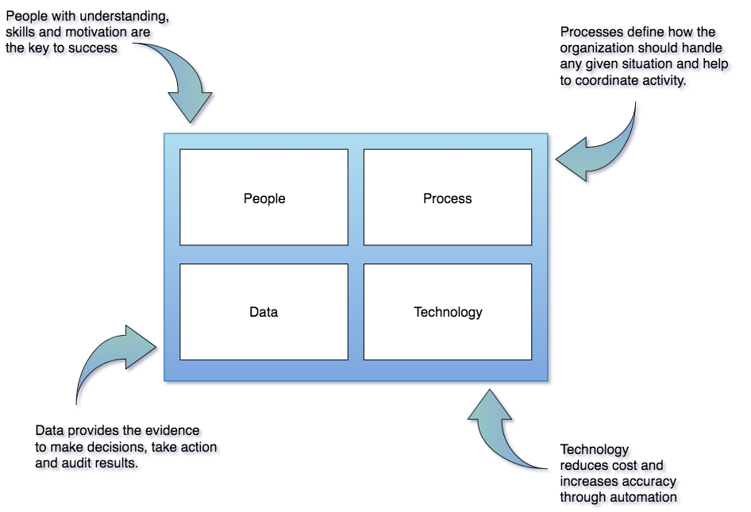

<!-- SPDX-License-Identifier: CC-BY-4.0 -->
<!-- Copyright Contributors to the ODPi Data Governance project. -->

# Welcome to ODPi data-governance

There is a lot going on in the field of data governance, due to the increased use of data intensive applications and
the corresponding rise in regulations around safe data use.

Traditional approaches to Data Governance developed for the Enterprise Data Warehouse are failing because they are too rigid for today's use cases.  However, many of the tools and techniques used in these programs are still valuable. 

The ODPi Data Governance Project helps organizations adopt hollistic governance practices for data and the digital services that use them.  These practices consider (1) the people involved, (2) the data they need to make good decisions, (3) the processes they need to follow and (4) the technology that automates much of the routine work.

> Figure 1: The components of a governance program

Open and integrated data tools, engines and data management platforms are key to this vision.  
**ODPi Egeria** is a sister project to ODPi Data Governance that provides the 
[open standards and services](https://odpi.github.io/data-governance/Open-Metadata-and-Governance) for more information
to support the data governance approach outlined in these governance paractices.

## Getting involved in the discussions

All ODPi projects are open for collaboration.
You are welcome to join our weekly calls. They are Thursday 9:00am to 10:00am US Eastern and the meeting minutes are published on this [wiki](https://github.com/odpi/data-governance/wiki).

There are also a [slack channels](https://odpi.slack.com/) that you can join (you need a [Linux Foundation account](https://identity.linuxfoundation.org) to log on).

## Latest Published Material

* [Coco Pharmaceuticals Personas and Scenarios](https://odpi.github.io/data-governance/coco-pharmaceuticals/) describes the personas and scenarios that are driving the work of both Egeria and the Data Governance Best Practices.
* [Governance Roles](roles) describes the different roles that people perform in a governance program.
* [Digital Services](digital-services) describes concept of a digital service and the lifecycle stages it goes through.
* [Data Privacy Pack](data-privacy-pack)
