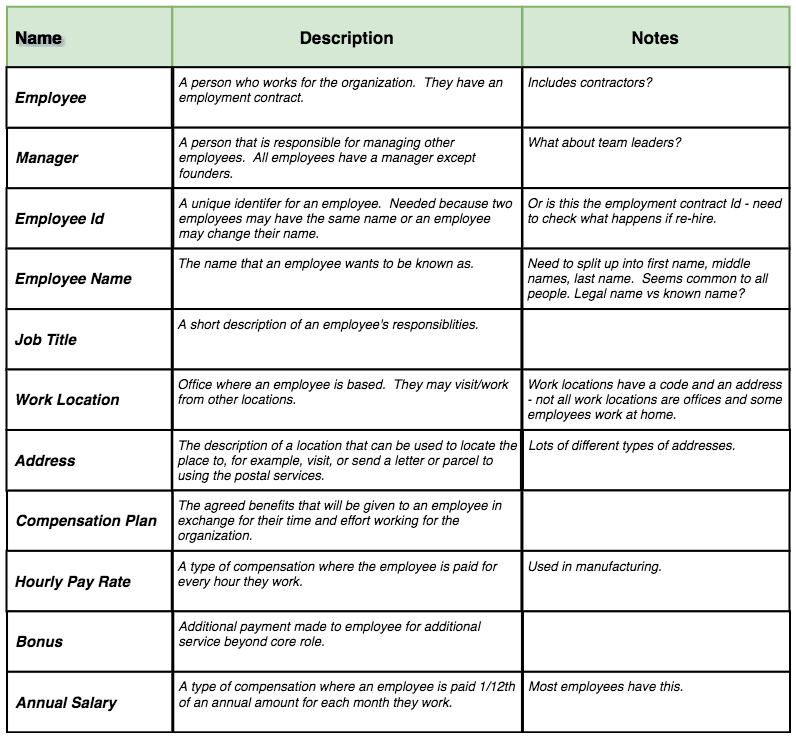
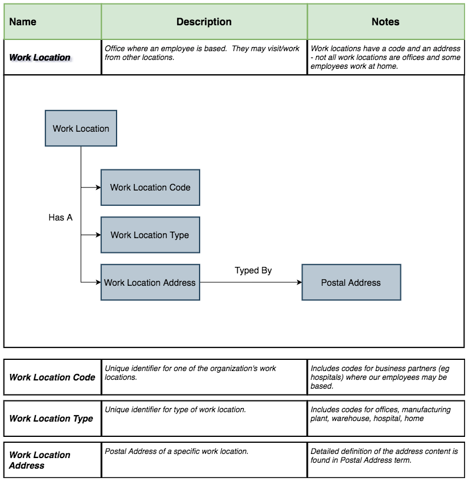
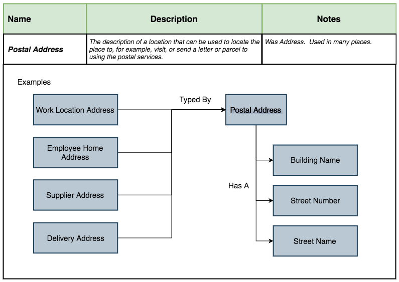
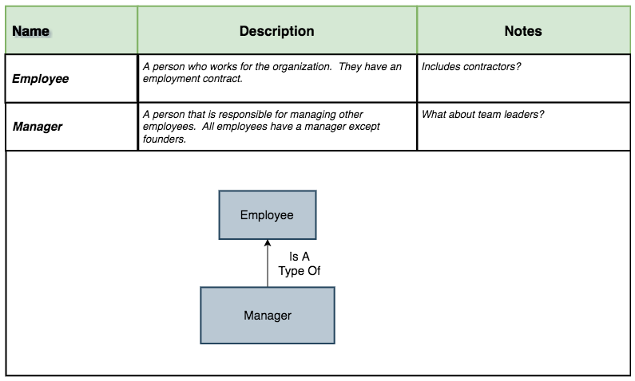

<!-- SPDX-License-Identifier: CC-BY-4.0 -->
<!-- Copyright Contributors to the ODPi Egeria project. -->

# Defining a glossary

A [glossary](../../../common-data-definitions/anatomy-of-a-glossary.md)
is a collection of common data definitions, typically focused on defining the meaning of data.
The process of building a glossary is iterative and collaborative.  It switches between creating a
overview of the content and then drilling down into the specifics, increasing the precision, before returning to
review the overall consistency of the definitions.

Often organizations begin with a simple exercise to identify the broad topics that need to be covered.
These broad topics are called **Subject Areas**.  In an earlier scenario,
[Erin Overview](../../personas/erin-overview.md) created an initial list of [Subject Areas for Coco Pharmaceuticals](../defining-subject-areas/README.md).   

In this scenario, Erin is working with [Faith Broker](../../personas/faith-broker.md) the director for human resources on the employee data subject area.

## What are the initial list of key concepts?

> Figure 1: Defining the initial list of terms

## Drilling down to fill out more information

> Figure 2: Refining Work Location

> Figure 3: Redefining Postal Address

> Figure 4: Defining Manager

----
License: [CC BY 4.0](https://creativecommons.org/licenses/by/4.0/),
Copyright Contributors to the ODPi Egeria project.
