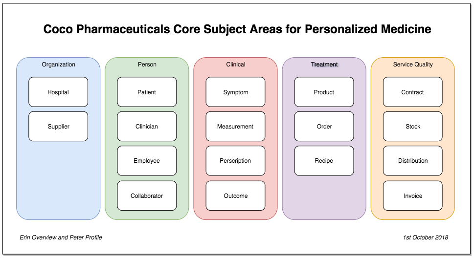

<!-- SPDX-License-Identifier: CC-BY-4.0 -->
<!-- Copyright Contributors to the ODPi Data Governance project. -->
# Defining Subject Areas

[Jules Keeper](../../personas/jules-keeper.md) asks [Erin Overview](../../personas/erin-overview.md) for a list of the key subject areas managed by the IT systems today.

To be sure she understands, Erin asks Jules what he means by “subject area” - Jules says - the different topics of data.

To Erin “subject area” sounds like a “data domain” and Jules agreed.  Data Domain is probably a more formal name - but the term “domain” is used in different contexts and that can be confusing to people who are new to the concepts around a data-driven enterprise.  For example, it is used in the term “Governance Domain” which is a focus area for governance such as data, security or privacy.  He tends to use the term subject area since it seems to be easier for people to remember.

Erin then asks how granular should they go in defining the subject areas - for example, “Address” is a subject area but very fine-grained.  Alternatively, they could start with some broader subject areas (say about 10) that would make it easier to engage the other teams and help find business owners.

Jules agrees they are going to need the very granular subject areas eventually but to get them started, the broader, business oriented subject areas are more useful.  He also suggests that rather than focusing on the whole business, she should emphasises the areas of the business that are most impacted by the move to personalised medicine - such as patient, treatments and sales.

Erin enlists [Peter Profile](../../personas/peter-profile.md) to help.

## Considering the Enterprise Information Model

Peter reminds Erin that they worked on an enterprise information model (EIM) a few years ago which may be a useful input.

> Figure 1: Data domains from Coco Pharmaceutical’s existing EIM

The EIM turned out to be a good reflection of today’s business since there is a clear separation between the
data used in the product development and research work that [Tessa Tube](../../personas/tessa-tube.md) leads, the sales process,
manufacturing and finance.

They compared this model with the catalog of systems that [Gary Geeke](../../personas/gary-geeke.md) has created as part of his
new role as the IT Infrastructure governance leader.

Again, there was a surprisingly straight-forward mapping between the systems owned by each part of the business
and the subject areas.  Erin concluded that there was little data sharing going on today beyond the common
use of the product catalog and customer list by Sales and Distribution from Manufacturing.
The finance teams had the biggest overlap with the other parts of the business because income and expenses all
flowed to them.

Erin guessed that personalised medicine may well increase the data sharing between the research and development
teams and the clinicians in the hospitals.  She was not so sure if sales and manufacturing were affected.

## View from manufacturing

Erin spoke to [Stew Faster](../../personas/stew-faster.md) from manufacturing.
He has been looking at modernization of the manufacturing line
to make it ready for their new lines of drugs.
He said their future plant would use a lot more data and automation
since they needed to be able to manufacture much smaller batch runs,
maybe even down to a single patient dose for some drugs.

He said today, once a new drug is approved, they effectively get a recipe from the research team and works with their
procurement team to find suppliers.  He then designed the manufacturing and quality control processes.
Big batches of each drug are manufactured, a small percentage is pulled to one side for quality testing and once approved,
the rest is packages and distributed to the customers (typically hospitals).

Going forward he sees them needing to support a much broader list of manufactured products, with short
lead times to first put a manufacturing process into place and then to create small batches on demand.
The distribution process needs a big overhaul as the resulting drugs need to be sent to the right clinician
in the right hospital for the right patient at the right time.
This is very different from a regular delivery of a fixed order to each hospital.

## View from Sales

Erin then goes to talk to [Harry Hopeful](../../personas/harry-hopeful.md) from Sales.
Harry is an experienced sales person and knows everyone in the research hospitals where Coco Pharmaceuticals
has their main business.  Erin asked how the sales process would change.
He said that today he works with the consultants and persuades them of the value of the drugs offered by Coco Pharmaceuticals.
Harry then works with the consultants to put pressure on the procurement department to approve the desired products.
Procurement then orders batches of the drugs as the consultants use up the stock.
Harry gets paid for each order that comes in.

Prior to talking to Erin, Harry had expecting that much of the same selling process will continue as before.
However he realises that the orders will need to come in in smaller batches, based on treatment need.
Coco pharmaceuticals needs to begin working with the procurement teams at the hospitals now to change the
approval process for orders since they can not be delayed for the standard procurement process.
At the same time the procurement teams will need some role to control costs so he imagines he will be more involved
with them as they jointly monitor usage over time.

## Conclusions

Erin is getting a picture from these conversations that the notion of Patient, Clinician and Treatment
needs to become more prominent in the subject areas, and this is linked to the clinical measurements, symptoms and outcomes.
The clinical teams focus on these to determine the treatment for the patient.
A prescribed treatment configures the desired product which drives manufacturing.
Finance produces the invoices for the product orders and pays the suppliers as they deliver raw materials.
But the stock management becomes more critical as manufacturing is driven on a patient demand basis.

Erin is surprised how much shifting her focus towards the needs of their business transformations has affected
the subject area model.  Her original EIM matched the organisational structure of the business.
It challenged nothing in the status quo.
The new subject area model has drawn out the most important subject areas for the business that need
focus and attention now.

> Figure 2: Coco Pharmaceutical’s new candidate subject area model

