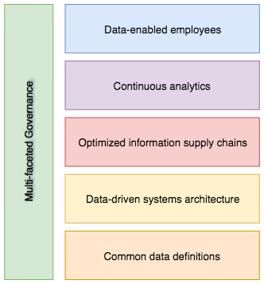

<!-- SPDX-License-Identifier: CC-BY-4.0 -->
<!-- Copyright Contributors to the ODPi Data Governance project. -->

# Defining the data strategy - "better data for everyone"

The fundamental question behind any data strategy is:

```
    How can data assist the organization in delivering its business strategy?
             
```

The business strategy may be to move into a new geography, radically change its operations to meet competitive challenges or to develop a new product line.
Whatever the direction of the business strategy, there is always an element of internal business transformation and a need for information about the new opportunity that the business strategy embraces.

[Jules Keeper](../../personas/jules-keeper.md) was hired by Coco Pharmaceuticals to drive their data strategy.

During his first few weeks at Coco Pharmaceuticals, Jules spent his time understanding the workings of the business and the impact of the new business strategy of moving towards personalised medicine.

To date they have developed one new personalised treatment that is designed for patients with a specific genomic marker.
The impact on the business was as follows:
* The research cycle was quicker since developing proof of a drug's efficacy was simpler.
* Since the new drug was only designed for a subset of patients, the hospitals are not willing to order big batches of the drug.   They are looking for a more on-demand ordering model.
* The manufacturing team realized that they will need to operate a hybrid model where all existing drugs are manufactured according to the existing batch processes, and the new drugs need more agile planning, manufacturing and delivery processes.  This has a knock on effect to their suppliers and finance.

As Jules dug deeper he noticed that the exchange of data between different parts of Coco Pharmaceuticals was pretty minimal, focused on the regularly scheduled processing of orders, manufacturing and deliveries.  Going forward, Jules could see that key people in Coco Pharmaceuticals are going to need accurate real-time data that helps them manage a dynamic and constantly changing business.

In particular:
* The physicians and supporting medical staff will need interactive support for drug choices based on their patients' characteristics and responses.
* The new team that works with the hospitals supporting new orders, validating results, liaising with manufacturing and research will need up to date information about the clinicians and patients under treatment.   They need to be supported by predictive analytics driven by the treatment plans and patient trends.
* Measurements from existing treatments could provide active data to supplement the research team as they look for new opportunities to cure different cancers for a broader range of patients.
* Finance need up to date information on suppliers orders / payments, patients orders / payments and future predictions so they can manage the cash flow.
* The board need to be able to understand which drugs are delivering profit, where the gaps are so they can direct research and sales/marketing.
* Manufacturing need details of the drug requirements coming from the active treatment plans so that they can plan and drive the manufacturing processes.

The purpose of the data strategy is to identify and plan how data can transform business to meet its strategic goals.

In Coco Pharmaceutical's case they need to reduce cycle times across business.  Data needs to be exchanged between different parts of the business as triggers for the different lifecycles.   New types of data needs to be collected, managed and used - all of this this implies an investment in new systems.

Jules realizes there is a lot to do!  He creates a simple framework that organizes what needs to be done into understandable chunks that can be delivered and measured incrementally.  Figure 1 shows his first attempt.


> Figure 1: Data Strategy Framework

He feels the names of the framework could be improved, but it essentially covers the major building blocks:

* **Common data definitions** - in order for Coco Pharmaceuticals to share data across its organization and with its
business partners, it needs shared agreements on what this data means, how it is formatted, expected quality and how it can be used.   This information is managed in a metadata catalog and should be used to configure the tools and IT systems used by the organization.
* **Data driven systems architecture** - the IT systems need to evolve to support the new data and process requirements.  They need to be integrated so that data flows between them in real-time enabling the new business model to execute effectively.
* **Optimized information supply chains** - the flow of data between the systems needs to be understood, optimized and managed so that any failure is quickly detected, located and resolved without affecting the service offered to the hospitals.
* **Authoritative sources** - provides trusted sources of key information.
* **Continuous analytics** - analytics is core to the discovery and validation of personaized medicine.  In addition, the agile nature of the corresponding business operations needs analytics to automate and monitor the flow of orders, manufacturing, delivery of drugs and payments.
* **Data enabled employees** - the managers of each part of the business, and the board, needs access to up-to-date information about how their business is operating.  They need to be able to use data to continuously evolve and expand the rand of treatments on offer.
* **Multi-faceted governance model** - finally, their governance model can not just cover data - their transformation needs and integrated governance program that covers data, infrastructure, privacy, security and corporate operations.  Jules needs to talk to the board about a comprehensive approach.  He envisages a team of governance leaders, each responsible for their own governance domain, but working together in a coordinated response.

Jules shares this framework with the board and his peers.  They are cautiously supportive but want to see more detail before committing to it.  The company has prided itself in its informality, collaboration and trust and this seems to be moving away from this model.  The board understands that things need to change but they created Coco Pharmaceuticals as a startup and is it very dear to them.  They have no experience of how to scale it up to meet the new business needs.  The effort looks expensive and is likely to divert investment from pure research which is also something that they are concerned about.

Jules is not discouraged by the feedback - in fact, he is pleased that his colleagues have openly expressed their concerns so he can work with them to ensure the right compromises between evolution and tradition are maintained.

He begins to work on the next level of detail:

* [Planning for common definitions](../planning-for-common-data-definitions)
* [Identifying authoritative sources](../identifying-authoritative-sources)
* [Defining the new data-driven systems architecture overview](../defining-new-systems-architecture-overview)
* [Defining the key information supply chains](../defining-information-supply-chains)
* [Defining what is meant by continuous analytics](../defining-continuous-analytics)
* [Defining how employees can be data-enabled](../defining-data-enabled-employees)
* [Defining why a multi-faceted governance model is needed](../defining-multi-faceted-governance)


----
License: [CC BY 4.0](https://creativecommons.org/licenses/by/4.0/),
Copyright Contributors to the ODPi Data Governance project.
