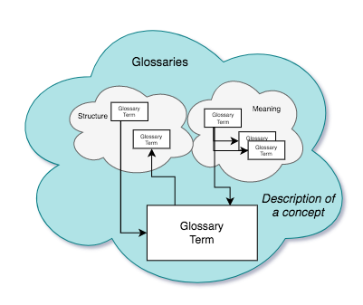
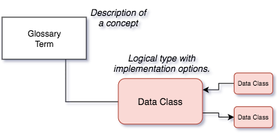
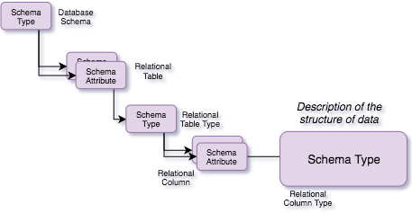
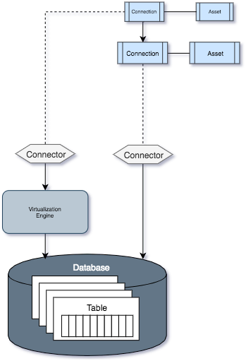
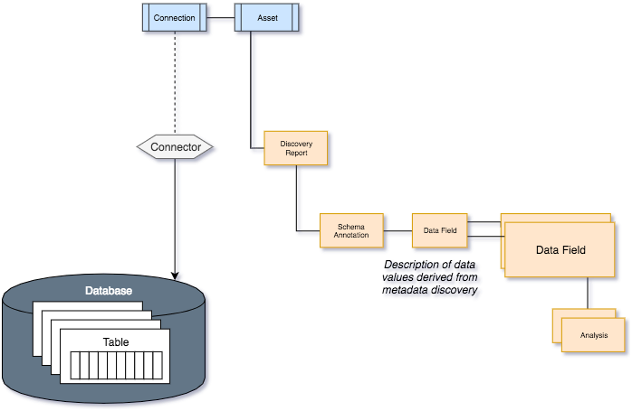
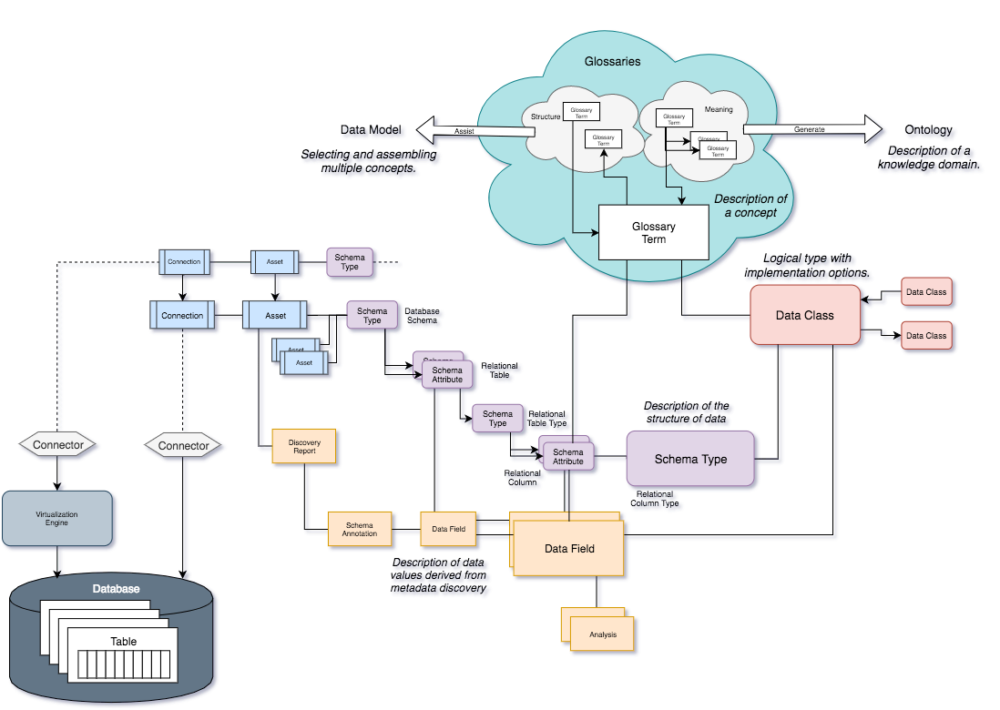

<!-- SPDX-License-Identifier: CC-BY-4.0 -->
<!-- Copyright Contributors to the ODPi Data Governance project. -->

# Open metadata for common data definitions

The [ODPi Egeria project](https://odpi.github.io/egeria/) provides a comprehensive set of
[open metadata types](https://odpi.github.io/egeria/open-metadata-publication/website/open-metadata-types/)
for managing [common data definitions](README.md).  These types provide a common language and format for exchanging
these definitions between tools and metadata repositories.  Each tool/repository provides a mapping to the ODPi Egeria types
and Egeria manages the exchange of metadata between these parties.

## The glossary

The glossary is at the heart of the common data definitions.
Figure 1 shows that the glossary contains glossary terms.  Each term describes a concept used by the business.

> Figure 1: Glossaries for describing concepts and the relationships between them

## Data classes

> Figure 2: Data classes for describing the logical data types and implementation options

## Schemas

> Figure 3: Schemas for documenting the structure of data

## Schemas and assets

> Figure 4: Assets for documenting the organization's important data assets

## Connectors and connections

> Figure 5: Connection information needed to access the data held by an asset

## Metadata discovery

> Figure 6: Output from a metadata discovery engine

## Bringing it all together

> Figure 7: Linking the metadata together

----
License: [CC BY 4.0](https://creativecommons.org/licenses/by/4.0/),
Copyright Contributors to the ODPi Data Governance project.
