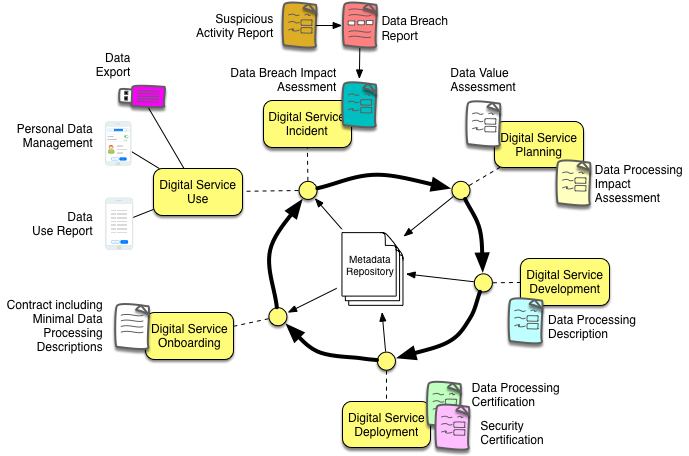

<!-- SPDX-License-Identifier: Apache-2.0 -->
# The ODPi Data Privacy Pack

The **ODPi Data Privacy Pack** provides best practices and related content to assist an organization in creating a data privacy
program and implementing it across its operations.  The contents are written for the organization's
**[privacy officer](https://odpi.github.io/data-governance/roles/privacy-officer-role.html).
This is the person responsible for defining the privacy policies and ensuring they are implemented and followed.

## Why is a data privacy program important?

Data privacy is being written into law in many regions today and this legislation/regulation
is both broadening the scope of data covered and
increasing the penalties for non-compliance.
Being able to manage your organization so people's rights relating to their data
is a basic capability for doing business in many places.

More importantly, but often forgotten, is that an organization's attitude to the wishes of its customers, employees and business
partners over the processing of their data shows clearly in the way the organization operates.
The actions taken to ensure data privacy lead to higher levels of customer service, better internal efficiency and
a more respectful working environment for employees by creating transparency in the way the organization
operates and eliminating unnecessary processing and storing of data.

## The role of the privacy officer

The appointment of the privacy officer is the first step in acknowledging the importance of data privacy to the business.
The privacy officer provides focus on the privacy challenge and assesses how well the organization is meeting that challenge,
making adjustments as necessary.
For it is indeed a challenge.
Respecting privacy is likely to impact all aspects of the business, which means many of the
roles within the organization will change.

## What does having a data privacy program entail?

A data privacy program ensures that an organization processes data about individuals (or data that may identify an individual) with
respect to that individual's wishes, whilst ensuring that minimal data is used and retained for this processing and 
it is propertly protected so an unauthorized third party can not access it for their own purposes.

At a high level, it entails:

* Defining the scope of data about individuals that needs special treatment - this data is called **personal data**.
Within the personal data category is **sensitive persional data** which requires additional care.

* Documenting where personal data is stored and used.

* Validating that all processing of personal data is with consent of the individula concerned (called the data subject).

* Creating, implementing and enforcing governance controls that ensure any changes to the processing of
personal data are recorded and validated according to the privacy policies.

* Providing capability within the digital service where the data subject can exercise their rigths with respect to their data.

## Getting started

An important place to start is to document and understand the 
[digital services](https://odpi.github.io/data-governance/digital-services) operated by your organization.

These digital services may be:
* to directly support your customers
* to support and manage your employees
* to enable collaboration with business partners
* to interact with legal and regulatory authorities (such as tax, data protection, ...)

These digital services are likely to identify the principle uses of personal data and where it is stored.

The effort required to build this inventory is going to be proportional to the size and complexity of the organization.
This means it needs prioritization and can not be left to the sole effort of the data privacy officer.

The data privacy officer needs to appoint owners of digital services for each business area and have them create
the inventory of their digital services since they will be responsible for the correct operation of the services.

## Digital service lifecycle

Each digital service will follow a [lifecycle](https://odpi.github.io/data-governance/digital-services/digital-service-lifecycle)
for how it is developed from an initial idea, to a working service and then operated
and improved until it is decommissioned.  Every organization will have its own definiton of the lifecycle, but for purposes
of illustration, the Data Governance PMC has developed a simple lifecycle that can be used to show how data privacy
controls can be introduced.

Figure 1 shows this simple lifecycle with the data privacy controls overlaid.  Details of these controls are described
below the figure.  the aim is to gather information about the data use in a digital service to demonstrate compliance
as the digital service is developed in the most cost effective manner and use the associated processes to design, develop,
deploy and operate the digital service in a way that ensures data privacy is respected.

**Figure 1:** The additional steps needed to manage data privacy throught the digital service's lifecycle

* Data Value Assessment - review of the types of data expected to be captured and why they are needed
* Data Processing Impact Assessment - review of the likely impact on an individual (data subject) if their data is processed
by this digital service.
* Data Processing Description - details ofthe data usage within a digital service.
* Data Processing Certification - certifies that the data processing description for the digtial service accurately reflects
its processing.
* Security Certification - certifies that the infrastructure where the digital service will run is complianct with the
appropiate security standards.
* Contract including Minimal Data Processing Descriptions - these are the terms and conditions that an individual signs up to when
they enroll with the service.  This determines the **legitimate interest** of the digital service, which effectively states
that this is the minimal use of personal data that the digital service needs to operate.
* Data Use Report shows the audit report of the data use for the data subject (and/or data controller if this service
is a data processor.)
* Personal Data Management - provides the controls for a data subject to exercise their rights.
* Data Export - Data subjects have the right to request their data stored by your digital services.
* Suspicious Activity Report - describes some activity that needs investigating.
* Data Breach Report - describes a dara creach - what happened and the steps to recover from it.
* Data Breach Impact Assessment - covers the impact of the data breach on the data subjects involved.

