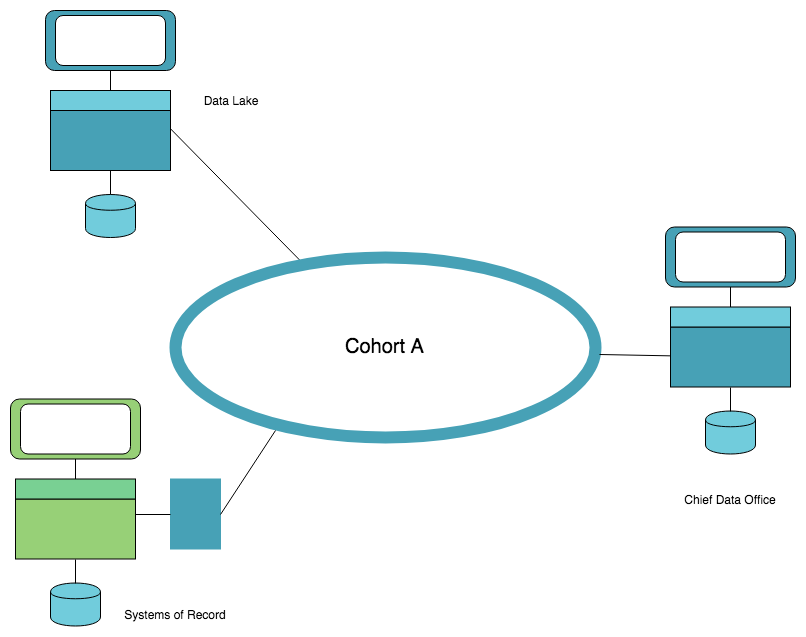
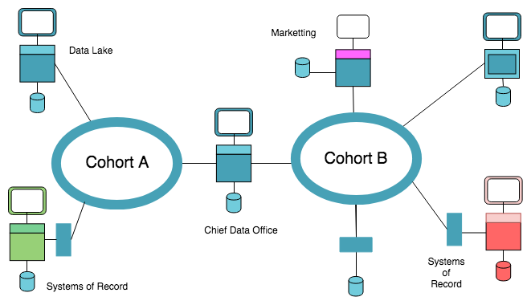
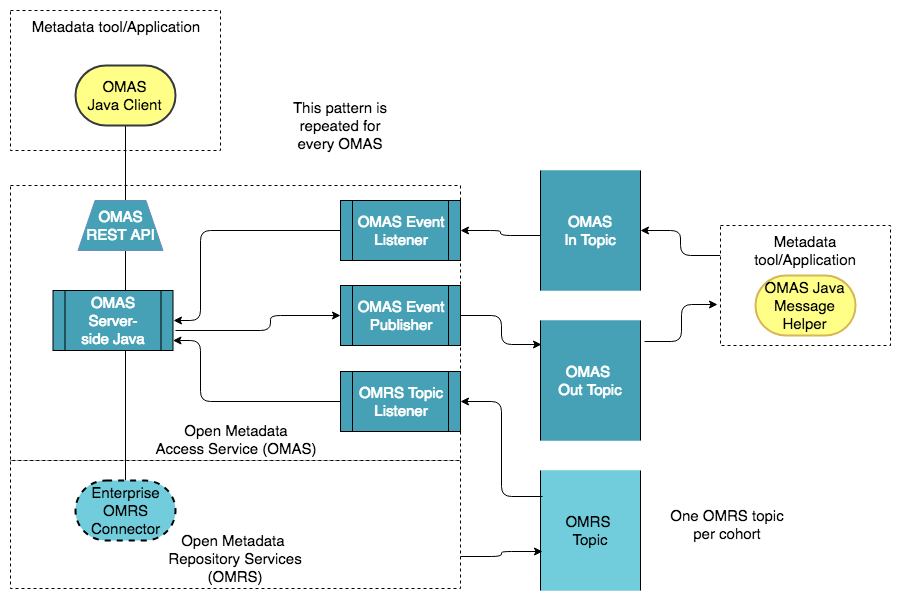
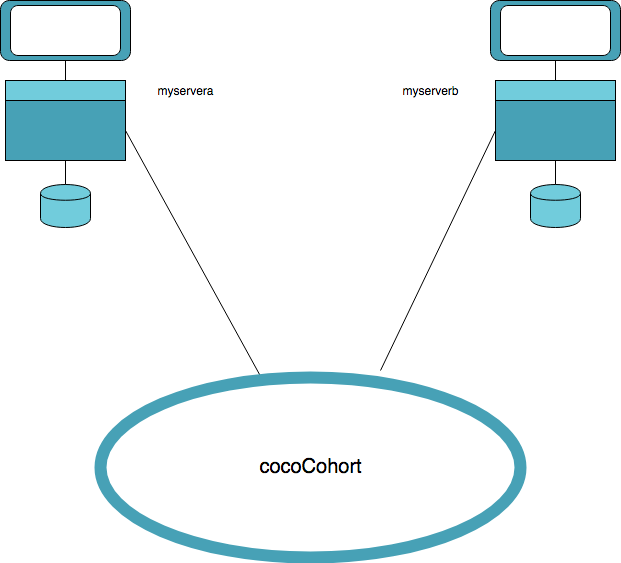

# Diagrams for use in data governance Presentations

Diagrams in presentations can be authored in many ways. Often they are included in presentations as
image files. This makes it difficult for people, other than the author, to update those diagrams. 
   
Some data dovernance diagrams have been authored on https://www.draw.io/. The diagrams can be exported as xml files. 
If there is a need to update one of the diagrams then the xml files can be imported into draw.io, updated and exported
as a new version.

The diagrams that have been created are : 

##Architecture diagrams
#####xml file name : Egeria-Cohort-v1.xml 
#####Description : Architecture diagram of Egeria cohort
  

#####xml file name : Egeria-Cohorts-v1.xml 
#####Description : Architecture diagram of Egeria cohorts
 

#####xml file name [Egeria-OMAS-v1.xml 
#####Description : Architecture diagram of an OMAS
 

##Diagrams for demonstration explanations

#####xml file name : Egeria-cocoCohort-for-demo-v1.xml 
#####Description : In memory demo cohort picture 
 
