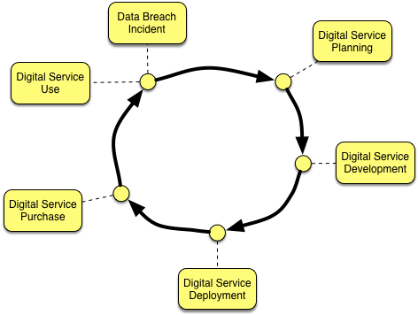
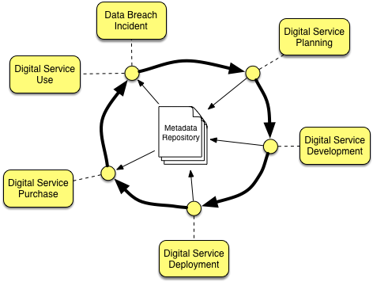

<!-- SPDX-License-Identifier: Apache-2.0 -->
# Digital Service Lifecycle

Every **[digital service](https://odpi.github.io/data-governance/digital-services/)** has a lifecycle that takes it from
a good idea, to a running service that is repeatedly enhanced until the service is decommissioned and shutdown.

While the service is running, it is processing requests from its consumers, sending requests to the digital services that
it is dependent on and typically accumulating data.

There may also be incidents, such as service outages and data breaches occuring while the service is running and also requests
from consumers for access to their data.

Figure 1 shows the lifecycle of a digital service.  The stages shown are described below the figure.

**Figure 1**: The lifecycle of a digital service

* **Digital Service Planning** covers the work to evaluate the business value of developing and running the digital service.
This will include creating estimates of its development costs, and cost to run plus the likely uptake of the service and
resulting buisness value.  Much of this will be done by the business owner supported by an architect to sketch out the
design of the digital service.

* **Digital Service Development** covers the implementation of the digital service plus the support mechanisms,
business operations, launch and marketing planning for the digital service.

* **Digital Service Deployment** covers the work to push the digital service into production.

* **Digital Service Onboarding** covers the sales/recruiting process to onboard users to the digital service.

* **Digital Service Use** covers the production use of the digital service.

* **Digital Service Incident** covers the management of an incident such as an outage, upgrade of essential
infrastructure or data breach.

An open metadata repository can be used to maintain information about the digital service.
This can link knowledge of th business model, governance requirements and implementation, making it possible for collaboration
correct action and an audit history to be maintained throughout the lifetime of the digital service.

Figure 2 shows the metadata repository in place.

**Figure 2**: Using a metadata repository to manage the lifecycle of a digital service

The open metadata types includes the definition of a digital service entity.
This is used in the [data privacy pack](https://odpi.github.io/data-governance/data-privacy-pack/).
