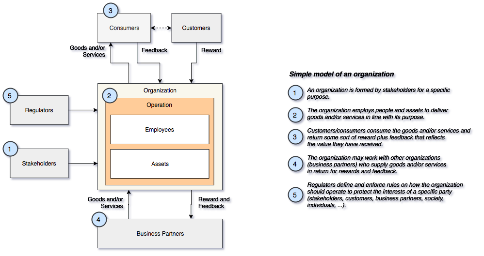
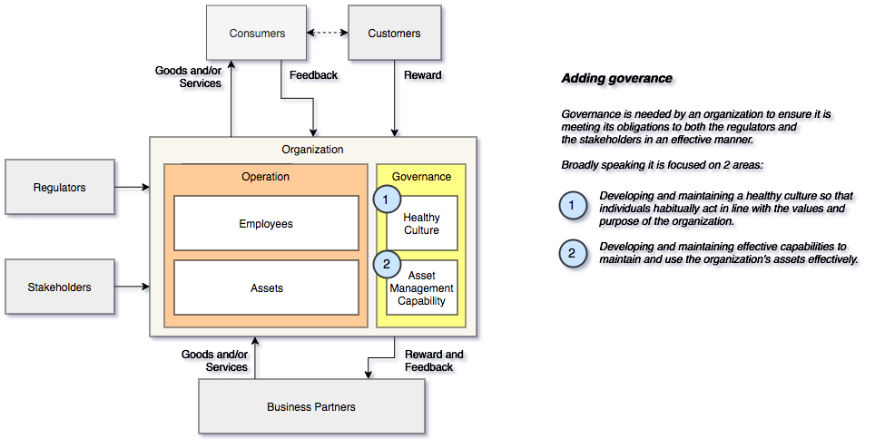

<!-- SPDX-License-Identifier: CC-BY-4.0 -->
<!-- Copyright Contributors to the ODPi Egeria project. -->

# Guidance on Governance Introduction

Governance enables all types of organizations (multi-nationals, small businesses,
government services, non-profits ...) to operate effectively and ethically.

It delivers management system that focuses on the culture
of the organization and the way it develops, maintains and uses assets.

Both of these aspects are of extreme importance to modern organizations because:

* Natural resources need to be used in an efficient and sustainable manner.
* Digital services operate at a scale beyond an individuals ability to understand,
monitor and control.  The technology is moving rapidly and the complexity of
modern systems means that the people operating them need specific automated help
to ensure they are secure and operating correctly.
* Regulation is imposing exacting requirements on traceability
of the organization's activity.
* Social changes are creating expectations that people are treated with
respect and as individuals.  The organization must embrace the
diversity of the people that interact with it, and treat them fairly.

Good governance creates transparency in an organization's operation and
enables people to develop and be the best they can.

Although each organization is different, there are many common aspects
to the way they work (largely because they are built and operated by people)
that can act as the framework to this collection of guidance
on developing a governance capability.

Consider figure 1:

> Figure 1: simple model of an organization

This simple model highlights the key drivers of any type of organization.

Consider the organization's **stakeholders**.  For a commercial organization,
they are the investors.  For a department within an organization, they could
be the management committee that created the department.  For a charity, they
are the founders of the organization.

Whoever the stakeholders are, they define a **purpose**
for the organization (eg making a profit selling fish,
supporting an organization's IT systems or feeding starving people after a disaster.)
Obviously the purpose can evolve over time, but basically the organization is
considered successful if it is meeting its purpose.

For the organization to get started, it needs **investment**.  This typically comes from
the stakeholders.  They are therefore keen to see that they are
getting good value for the investment they provide.  That is,
they want to see that the organization is **cost-effective**.

The organization can spend the stakeholder's investment on:

* People to work on meeting the purpose (employees),
* Assets to support their work (see **Note**),
* Paying a business partner to perform some of the work that is needed.

>**Note**: The use of the term "Asset" in this model is intended to cover a very broad definition.
Examples of assets include buildings, computers,
software packages, IT systems, processes, data stores,
analytical models, digital locations, intellectual property.

An organization can generate income from providing
goods and/or services in exchange for some sort of feedback and reward (payment).
These goods and/or services typically involve the organization creating more assets
using its employees, existing assets and business partners.

In most cases the recipient of the goods and/or services is the one
providing the feedback and reward.  However, consider a charity.
It supplies support to its target audience (consumers),
and receives donations from other sources (customers).
Also consider a service that is funded by advertising.  The customers
are the advertisers rather than the consumers of the service.

Typically, the purpose of the organization includes an aspect of
how well it supports its consumers and customers.  So the
reward often provides the ability to hire more employees and
create more assets.  The feedback helps them hone the goods and/or
services that they offer.

The organization aims to operate in a sustainable manner,
using the rewards it receives
from is customers to pay for its operation and, potentially provide rewards to
its stakeholders (assuming that is part of its purpose).

Finally the regulators protect the interests of particular groups that the
organization's activities may impact.  An organization
is often working with many types of regulators from
the governments and tax authorities of the territories where they a operating,
industry regulators ensuring fair competition, financial regulators
protecting investors, privacy regulators and safely
regulators protecting individuals, as some of the examples.

Governance has evolved as a series of practices and mechanisms within
an organization to ensure successful and cost-effective operation
that stakeholders and regulators can verify.

Figure 2 shows governance added to the simple organization model.

> Figure 2: simple model of an organization with governance

Governance covers both the employees and the organization's assets.
Often the governance of different types of assets and employees is
coordinated by different teams.  For example:

* Data assets are governed by the data governance team
* Financial assets are governed by the finance team
* Privacy is governance by the privacy team
* Security is governed by the security compliance team

However, their work is inter-related and follows a common pattern.
See [Governing Systems](../governing-systems) for more information.

## Further reading

* [The governance of data](../governance-of-data)
* [Delivering governance through the governing systems](../governing-systems)
* [Governance maturity model](../maturity-model)

----
License: [CC BY 4.0](https://creativecommons.org/licenses/by/4.0/),
Copyright Contributors to the ODPi Egeria project.