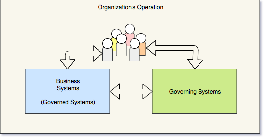
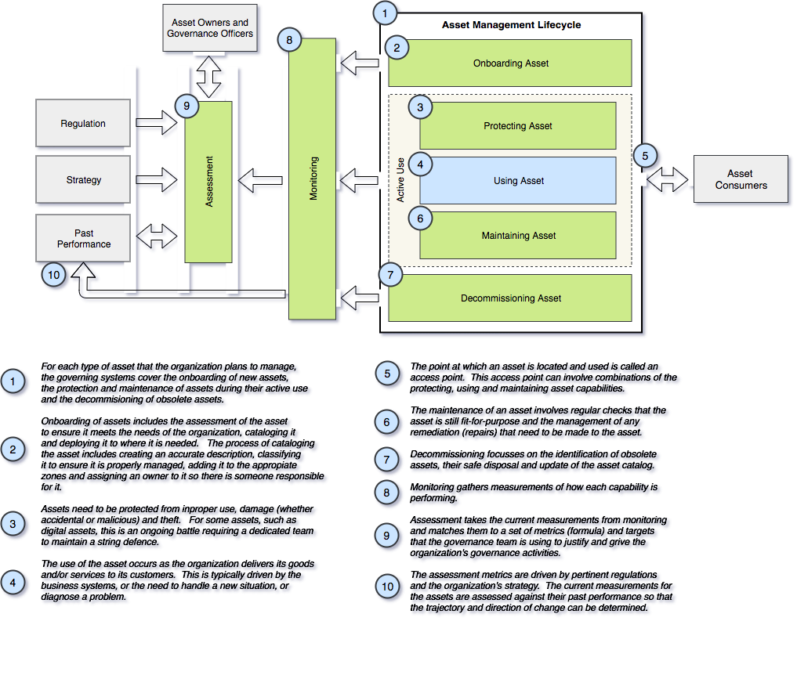

<!-- SPDX-License-Identifier: CC-BY-4.0 -->
<!-- Copyright Contributors to the ODPi Egeria project. -->

# The governing systems

Organizations operate as a series of systems that are made
up of people, the processes they follow and the technology
that supports them.

These systems, and their component parts, are some of the
[assets of the organization](../governance-basics).

Governance teams focus on building the systems that provide
a healthy culture and the asset management capability.  These
systems are called the governing systems.  They support the
business systems (that is, the governed systems).
See figure 1.

> Figure 1: Systems of an organization

Ideally governance is embedded in the daily work of the
organization, rewarding individuals who follow the practices
it encourages.  When this is the case, individuals engaging with
the organization use a blend of the business systems and the
governing systems to perform their role(s).  They may not even
be aware of the difference.

## Capabilities of the governing systems

The capabilities of the governing
systems are typically focused
on managing the
organization's assets.

Figure 2 details the type of capabilities provided by the governing
systems shown in green.  The business systems are shown in blue.

> Figure 2: Capabilities of the governing systems

Underpinning the capabilities of the governing system
is a knowledge base about the assets,
their relationships and the activity related to their
management.
This knowledge base is called the asset catalog
and it is one of the functions provided by a metadata repository. 

----
License: [CC BY 4.0](https://creativecommons.org/licenses/by/4.0/),
Copyright Contributors to the ODPi Egeria project.