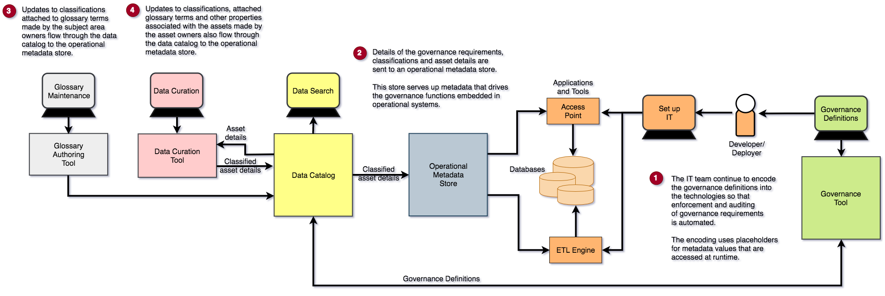

<!-- SPDX-License-Identifier: CC-BY-4.0 -->
<!-- Copyright Contributors to the ODPi Data Governance project. -->

# Business Driven Governance

Business driven governance is where the implementations of governance within the IT systems is driven by the
governance classifications and other metadata settings.  As the asset owners change the classifications
attached to the asset descriptions,
then the runtime governance functions change their treatment of the assets.

The big change that this brings is that the runtime governance functions need reliable and performant access to the
metadata.  Typically this is provided by an operational metadata catalog that its tuned for the needs of the
runtime governance components.

In fact there may be many operational metadata catalogs, one in each subsystem that manages assets.
Some technology may be so critical that is needs to keep its metadata in an inmemory cache that
is regularly synchronized from the master data catalog.

Figure 1 shows the business driven governance in operation.

> **Figure 1:** Capabilities needed to achieve Business Driven Governance

----
License: [CC BY 4.0](https://creativecommons.org/licenses/by/4.0/),
Copyright Contributors to the ODPi Data Governance project.
