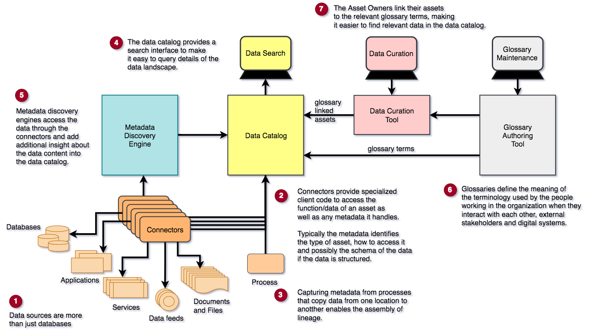

<!-- SPDX-License-Identifier: CC-BY-4.0 -->
<!-- Copyright Contributors to the ODPi Egeria project. -->

# Data Awareness

An organization has achieved **data awareness** when it has a catalog of its data assets that shows the properties
of the data assets, who owns them and their lineage (how they were created).

These catalogs ideally need to cover all types of data asset, from data stores, data feeds, APIs and the
processes/applications that work with them.  In addition, the catalog can include information about the logical structure
(schema) of the data, its format (for example, XML, JSON) the values stored and what the data elements within the asset mean to the organization.

Figure 1 shows the different types of tools that can be used to build up the data catalog and make it searchable through
a user interface.

> **Figure 1:** Capabilities needed to achieve Data Awareness

----
[^ Back to top](.) or [on to Governance Awareness -->](Governance-Awareness.md)
----
License: [CC BY 4.0](https://creativecommons.org/licenses/by/4.0/),
Copyright Contributors to the ODPi Egeria project.
