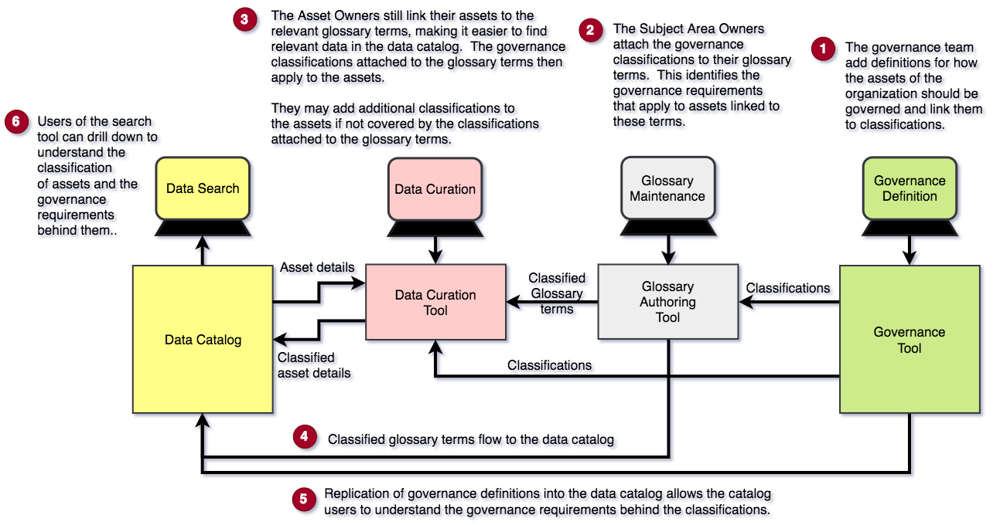

<!-- SPDX-License-Identifier: CC-BY-4.0 -->
<!-- Copyright Contributors to the ODPi Data Governance project. -->

# Governance Awareness

Governance awareness is where the governance requirements are attached to the data assets.  This means
that someone wishing to use a data asset can easily understand the governance requirements they must meet to
use it responsibility.

Most organizations use governance classifications.  These are labels that are attached to data assets.
The labels each define a list of governance requirements for different situations.
For example a governance classification could be "confidential".
The governance program would then describe the governance requirements for condicential data when, for example:
 * it is shared with a colleague,
 * passed to an external person,
 * stored etc
The governance program educated employees on the use  and meaning of the governance classifications so they know
how to manage any data with that classification.

Classifications can be added directly to an asset's metadata description, or the descriptions of the
data elements within the asset, or indirectly to the glossary terms that are linked to the asset/data element descriptions.

Figure 1 shows both options for adding classifications to the catalog.
Classifying through the glossary terms
creates greater consistency in the way that datai s classified,
but it does requirement that the attachment of glossary terms to the descriptions of assets/data elements is comprehensive.

> **Figure 1:** Capabilities needed to achieve Governance Awareness

----
License: [CC BY 4.0](https://creativecommons.org/licenses/by/4.0/),
Copyright Contributors to the ODPi Data Governance project.
