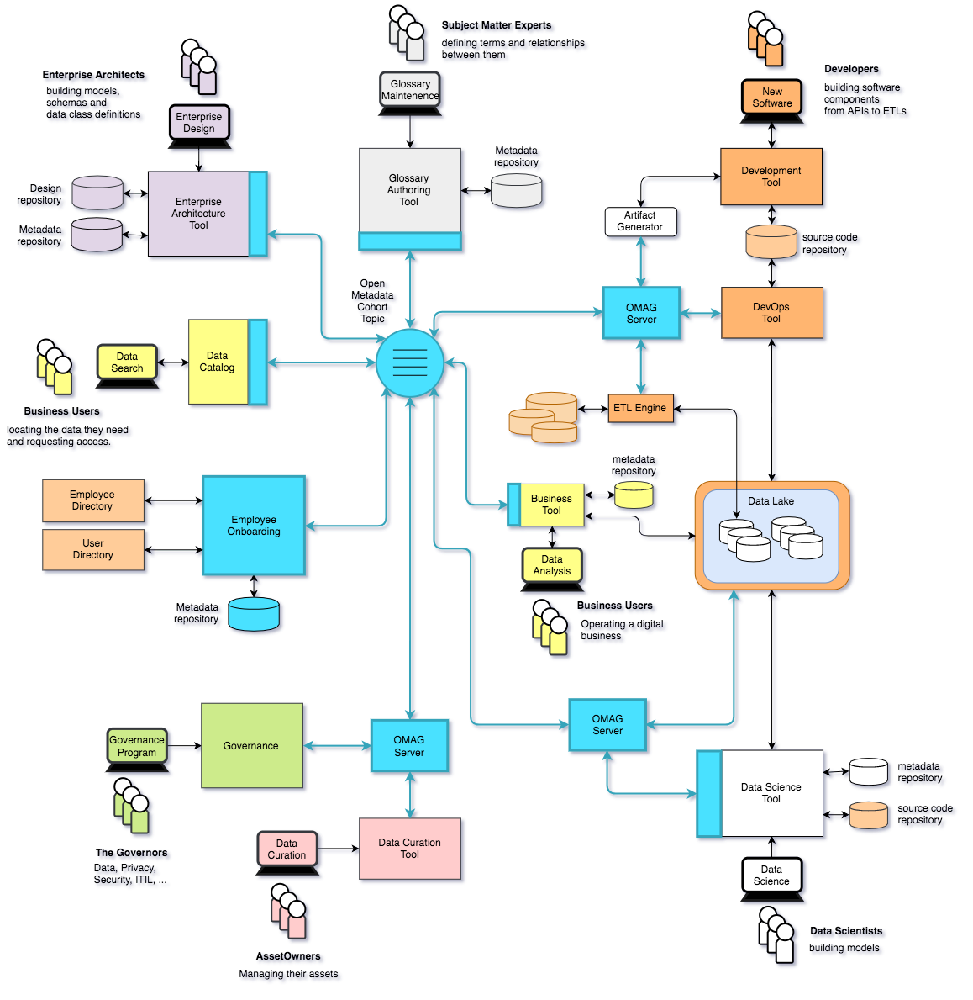

<!-- SPDX-License-Identifier: CC-BY-4.0 -->
<!-- Copyright Contributors to the ODPi Egeria project. -->

# Data Governance Maturity Model

The data governance maturity model was first published in 2018:

> REDP5486 The Journey Continues: from Data Lake to Data-Driven Organization
>
> http://www.redbooks.ibm.com/abstracts/redp5486.html?Open

It shows five levels of maturity that build on one another until the organization is able to support
a wide range of advanced data use along with appropriate self-service
access to data for a majority of people in the organization.
This is the capability that Forrester calls 
[Data Citizenship](https://www.forrester.com/webinar/Data+Governance+20+The+Journey+Toward+Data+Citizenship/-/E-WEB21683).

The maturity levels are:

* **[Data Awareness](Data-Awareness.md)** - where is the organization's data and what does it contain?
* **[Governance Awareness](Governance-Awareness.md)** - how should data be governed?
* **[Emdedded Governance](Embedded-Governance.md)** - how can governance be automated?
* **[Business Driven Governance](Business-Driven-Governance.md)** - how can the business leaders take ownership of data and governance?
* **[Data Citizenship](Data-Citizenship.md)** - how can every employee, system and server get the data they need, every day?

Click on the links above for more detail about each level.
You will notice that the number of integrations between tools,
engines and metadata repositories grows with each level of maturity.
[ODPi Egeria](https://odpi.github.io/egeria/open-metadata-publication/website/)
provides open standards and services to simplify this integration.

Figure 1 shows a mature landscape using egeria for integration.

> **Figure 1:** Data Citizenship with Egeria

The integrations show in light blue are using the Egeria open standards.

----
License: [CC BY 4.0](https://creativecommons.org/licenses/by/4.0/),
Copyright Contributors to the ODPi Egeria project.
