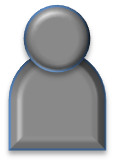

<!-- SPDX-License-Identifier: CC-BY-4.0 -->
<!-- Copyright Contributors to the ODPi Egeria project. -->

# Executive Role

<!---->

The executive is responsible for leading the direction of the
organization and speaking on its behalf.
Executives are responsible for the organization's compliance to regulation.

## Further information

* [Extensions to the executive role for privacy](../../data-privacy-pack/role-extensions-for-privacy.md)

----
License: [CC BY 4.0](https://creativecommons.org/licenses/by/4.0/),
Copyright Contributors to the ODPi Egeria project.