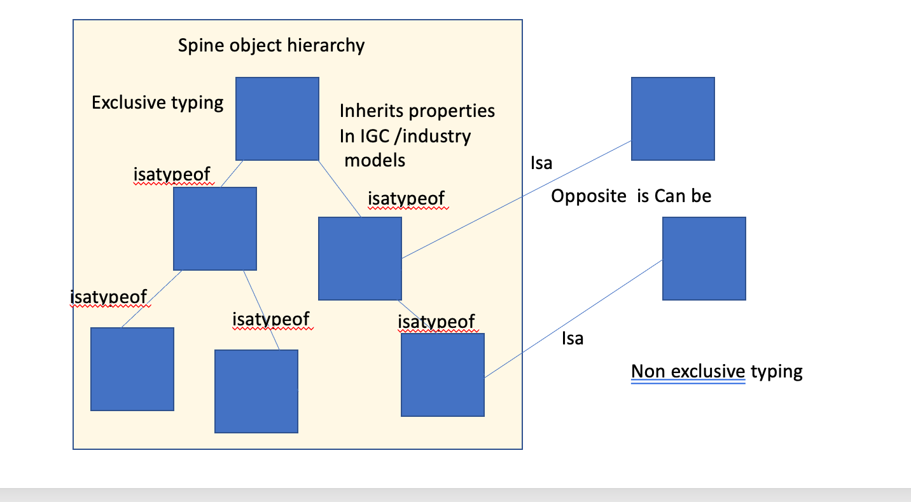

# Egeria Semantics workgroup 23rd of April 2020

## Agenda:
* David to present discussion on isa vs isatypeof relationships 

## Attendees:
* David Radley (IBM)
* Michal Miklas (IBM)
* Pat O'Sullivan (IBM)
* Michelle Viljoen (ING)
* Stefhan Van Helvoirt (ING)
* Oana Turbatu (ING)
* Chris Replogle (SAS)
* Ernie Ostic (Manta) 

## Minutes:
* David presented some slides as an introduction
* Michal noticed an error in the mapping of rdfs:subclassof into a Egeria. David will correct. in
[Git issue 5366](https://github.com/odpi/egeria/issues/5366) 
* The thinking we agreed upon was:
    * IsATypeOf is the relationship used in the main Term type hierarchy.
    * Isa is an alternative hierarchy.
    * A semantic model could have a main hierarchy or a multiple inheritance hierarchy
        * the isatypeof links a child to a parent    
        * conceptually the child cannot exist without the parent
        * the parental properties inherited by the child
        * the subtypes are mutually exclusive
    * What is also useful is a 'isa' relationship that is used as follows
        * it is non exclusive. 
        * the child can exist with the parent.
        * the opposite direction would be a 'can be' relationship
        * we would expect the properties to be inherited     
    * Michelle talked of isa relationships to concept terms and to relationship Terms
        * relationship terms do not have properties
        * Michelle said would come up with some examples that we can talk about how we would represent them in Egeria.      
        * Michelle thought there might be a need for a new relationship type, Michal wondered whether this was necessary if 
        the Terms had classifications that could discern the meaning without the need for a new relationship  
    * The ideas are summarized in this picture
    
    * We talked of the Owl metamodel and class to instance relationships. We thought that when this requirement needs to 
    be addressed we would introduce a new Egeria relationship called instanceOf to distinguish it from isa and isatypeof
    * Michal suggested we name the new Egeria corrected relationship as IsATypeOfRelationship. The old one being TermIsATypeOfRelationship.
    * Michelle thought is would be useful to be able to visualise a type hierarchy view based on some discriminators.    

## Next session:
* Both Michal and Michelle showed interested in holding a subsequent session, maybe around relationship terms.  